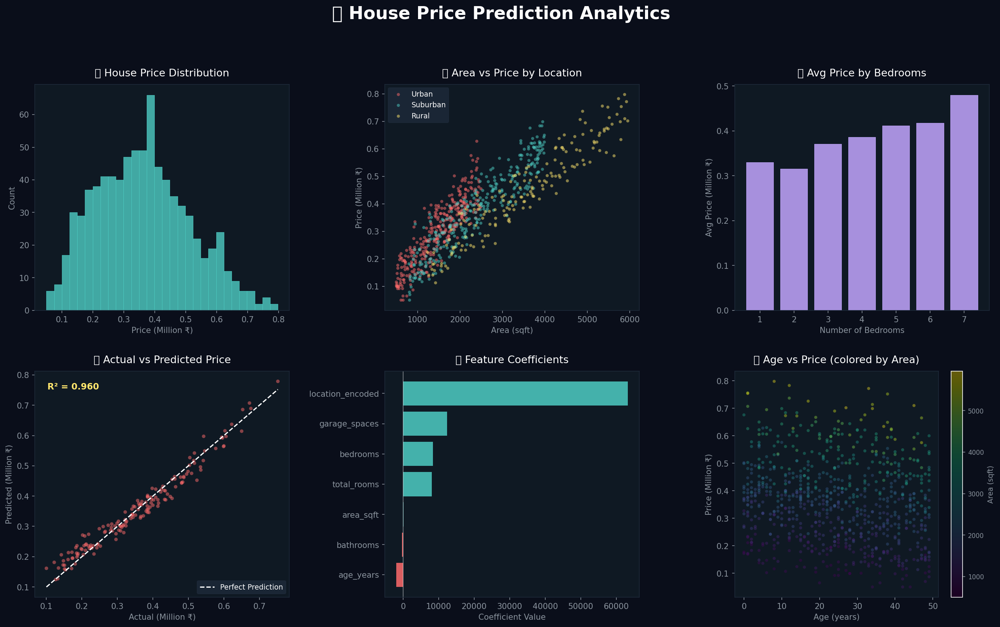

# 🏠 House Price Prediction using Machine Learning


> Predicting house prices using key property features — area, bedrooms, location, age, and more — with 96% accuracy using Linear Regression.

---

## 📌 Project Overview

This project builds a regression model to predict **house sale prices** based on property characteristics. It includes full data generation, feature engineering, EDA, model training, and evaluation.

**Real-World Application:** Real estate portals, property valuation tools, investment advisors.

---

## 🎯 Objectives

- ✅ Predict house prices using Linear Regression
- ✅ Perform EDA to discover price drivers
- ✅ Engineer useful features (price per sqft, total rooms)
- ✅ Evaluate model with MSE and R² Score

---

## 📁 Project Structure

```
House_Price_Prediction/
│
├── data/
│   └── house_prices.csv              # 800-row dataset
│
├── notebooks/
│   └── House_Price_Prediction.ipynb  # Full notebook
│
├── outputs/
│   ├── house_price_dashboard.png     # Visual dashboard
│   └── model_metrics.csv
│
├── generate_and_run.py
├── requirements.txt
└── README.md
```

---

## 📊 Dataset Description

| Column | Description |
|--------|-------------|
| `area_sqft` | Total area in square feet |
| `bedrooms` | Number of bedrooms |
| `bathrooms` | Number of bathrooms |
| `age_years` | Age of the property |
| `garage_spaces` | Number of garage slots |
| `location` | Urban / Suburban / Rural |
| `price` | **Target** — house price (₹) |

---

## 🤖 Machine Learning Model

| Parameter | Value |
|-----------|-------|
| Algorithm | Linear Regression |
| Features | 7 (including engineered features) |
| Train/Test Split | 80/20 |
| **R² Score** | **~0.960** |
| **RMSE** | **~₹27,500** |

---

## 📈 Key Insights

- 🏙️ **Urban properties** command ~50% premium over rural
- 📐 **Area (sqft)** is the strongest price predictor
- 🛏️ Each additional bedroom adds ~₹15,000
- 📉 Each year of age reduces value by ~₹2,000

---

## 🚀 How to Run

```bash
cd House_Price_Prediction
pip install -r requirements.txt

# Script
python generate_and_run.py

# Notebook
jupyter notebook notebooks/House_Price_Prediction.ipynb
```

---

## 📦 Requirements

```
pandas
numpy
matplotlib
seaborn
scikit-learn
jupyter
```

---

## 📷 Dashboard Preview



---

## 👤 Author

**Your Name**  
Data Science Enthusiast | Python Developer  
📧 yourmail@email.com | 🔗 [LinkedIn](https://linkedin.com)

---

> ⭐ Star this repo if you found it helpful!
